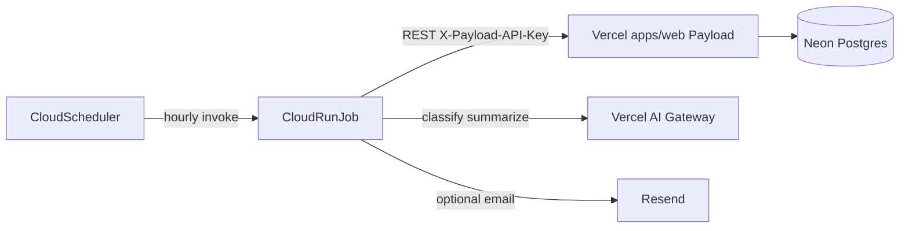

# Deploy the Monitoring Worker (GCP) and connect to `apps/web`

This guide deploys `apps/worker` as a **GCP Cloud Run Job**, triggers it with **one Cloud Scheduler** job (hourly), and connects it to a live **Vercel** `apps/web` via Payload REST.

Assumes `apps/web` is already in production with matching `PUBLIC_SITE_URL` and `PAYLOAD_API_KEY`.

---

## Architecture



| Piece                             | Role                                                                                         |
| --------------------------------- | -------------------------------------------------------------------------------------------- |
| **Vercel (`apps/web`)**           | Payload CMS + public feed. Owns Neon Postgres via `DATABASE_URL`.                            |
| **Cloud Run Job (`apps/worker`)** | One-shot pipeline: fetch → dedupe → classify → summarize → publish digests. Exits when done. |
| **Cloud Scheduler**               | Invokes the job hourly. **One** Scheduler job only.                                          |
| **Shared secret**                 | Same `PAYLOAD_API_KEY` on Vercel and on the job. Worker sends `X-Payload-API-Key`.           |

Important:

- The worker does **not** use `DATABASE_URL`. It talks to Payload REST only (`PUBLIC_SITE_URL` + `PAYLOAD_API_KEY`).
- Per-project `daily` / `weekly` / `monthly` cadence is enforced in application logic (`isProjectDue`), not as separate Scheduler jobs (Hobby / free-tier: keep ≤3 Scheduler jobs).
- Set `PUBLIC_SITE_URL` to the production site URL with **no trailing slash**, identical to Vercel Production.

---

## Prerequisites

- [ ] GCP project with billing enabled
- [ ] [`gcloud`](https://cloud.google.com/sdk/docs/install) authenticated (`gcloud auth login` + `gcloud config set project PROJECT_ID`)
- [ ] Docker (local build) or Cloud Build
- [ ] Vercel Production env already set:
  - `PUBLIC_SITE_URL` (stable production URL, no trailing slash)
  - `PAYLOAD_API_KEY` (worker will use the **same** value)
  - `PAYLOAD_SECRET` / `DATABASE_URL` (web only; not needed on the worker)
- [ ] [Vercel AI Gateway](https://vercel.com/docs/ai-gateway) API key for classify/summarize
- [ ] Optional: [Resend](https://resend.com) API key for digest email notifications

Enable APIs:

```bash
export PROJECT_ID="your-gcp-project-id"
export REGION="europe-west1"   # pick a region close to you
export AR_REPO="hht-containers"
export JOB_NAME="hht-monitor-worker"
export SCHEDULER_NAME="hht-monitor-hourly"

gcloud config set project "$PROJECT_ID"

gcloud services enable \
  artifactregistry.googleapis.com \
  run.googleapis.com \
  cloudscheduler.googleapis.com \
  secretmanager.googleapis.com \
  iam.googleapis.com
```

---

## Environment variables

### Shared with Vercel (must match Production exactly)

| Variable          | Required | Notes                                                                      |
| ----------------- | -------- | -------------------------------------------------------------------------- |
| `PUBLIC_SITE_URL` | Yes      | Same as Vercel. Example: `https://your-app.vercel.app`. No trailing slash. |
| `PAYLOAD_API_KEY` | Yes      | Same secret as Vercel. Worker sends it as `X-Payload-API-Key`.             |

### Worker-only (set on the Cloud Run Job)

| Variable                | Required | Notes                                                      |
| ----------------------- | -------- | ---------------------------------------------------------- |
| `AI_GATEWAY_API_KEY`    | Yes      | Vercel AI Gateway key. Classify/summarize fail without it. |
| `AI_GATEWAY_MODEL`      | No       | Default `openai/gpt-4o-mini`.                              |
| `RESEND_API_KEY`        | No       | If unset, digest email is skipped.                         |
| `RESEND_FROM_EMAIL`     | No       | Default `onboarding@resend.dev`.                           |
| `BATCH_SIZE_PER_SOURCE` | No       | Default `50`.                                              |

`BOOTSTRAP_LOOKBACK_DAYS` in `.env.example` is **not** read by the worker process; lookback comes from each project's `bootstrapLookbackDays` field (default 30).

`AI_GATEWAY_API_KEY` belongs on the Cloud Run Job for the monitoring pipeline. You may also set it on Vercel later for web-only features (e.g. on-demand translation); that is separate from this worker deploy.

---

## 1. Create Artifact Registry and push the image

Build context is the **monorepo root** (see [`apps/worker/Dockerfile`](../apps/worker/Dockerfile)).

```bash
# Create a Docker repository (once)
gcloud artifacts repositories create "$AR_REPO" \
  --repository-format=docker \
  --location="$REGION" \
  --description="HHT Research Platform images"

# Configure Docker auth for Artifact Registry
gcloud auth configure-docker "${REGION}-docker.pkg.dev"

export IMAGE="${REGION}-docker.pkg.dev/${PROJECT_ID}/${AR_REPO}/hht-monitor-worker:latest"

# From repo root
docker build -t "$IMAGE" -f apps/worker/Dockerfile .
docker push "$IMAGE"
```

---

## 2. Store secrets (recommended)

Prefer Secret Manager for keys; use plain env vars only for a quick smoke test.

```bash
# Paste values when prompted (or pipe from a file)
echo -n "YOUR_PAYLOAD_API_KEY" | gcloud secrets create payload-api-key --data-file=-
echo -n "YOUR_AI_GATEWAY_API_KEY" | gcloud secrets create ai-gateway-api-key --data-file=-
# Optional:
# echo -n "YOUR_RESEND_API_KEY" | gcloud secrets create resend-api-key --data-file=-
```

If a secret already exists, add a version:

```bash
echo -n "YOUR_PAYLOAD_API_KEY" | gcloud secrets versions add payload-api-key --data-file=-
```

Grant the Cloud Run Job runtime service account access to secrets. Default Compute SA:

```bash
export PROJECT_NUMBER="$(gcloud projects describe "$PROJECT_ID" --format='value(projectNumber)')"
export RUNTIME_SA="${PROJECT_NUMBER}-compute@developer.gserviceaccount.com"

for SECRET in payload-api-key ai-gateway-api-key; do
  gcloud secrets add-iam-policy-binding "$SECRET" \
    --member="serviceAccount:${RUNTIME_SA}" \
    --role="roles/secretmanager.secretAccessor"
done
# If using Resend:
# gcloud secrets add-iam-policy-binding resend-api-key \
#   --member="serviceAccount:${RUNTIME_SA}" \
#   --role="roles/secretmanager.secretAccessor"
```

---

## 3. Create the Cloud Run Job

Replace `https://YOUR_PRODUCTION_URL` with the exact Vercel `PUBLIC_SITE_URL`.

### With Secret Manager (preferred)

```bash
gcloud run jobs create "$JOB_NAME" \
  --image="$IMAGE" \
  --region="$REGION" \
  --tasks=1 \
  --max-retries=1 \
  --task-timeout=15m \
  --memory=1Gi \
  --cpu=1 \
  --set-env-vars="PUBLIC_SITE_URL=https://YOUR_PRODUCTION_URL" \
  --set-secrets="PAYLOAD_API_KEY=payload-api-key:latest,AI_GATEWAY_API_KEY=ai-gateway-api-key:latest"
```

Optional extras:

```bash
# Add model / batch size / Resend as needed (update job)
gcloud run jobs update "$JOB_NAME" \
  --region="$REGION" \
  --update-env-vars="AI_GATEWAY_MODEL=openai/gpt-4o-mini,BATCH_SIZE_PER_SOURCE=50,RESEND_FROM_EMAIL=digest@yourdomain.com" \
  --update-secrets="RESEND_API_KEY=resend-api-key:latest"
```

### Plain env vars (Hobby-speed smoke test)

```bash
gcloud run jobs create "$JOB_NAME" \
  --image="$IMAGE" \
  --region="$REGION" \
  --tasks=1 \
  --max-retries=1 \
  --task-timeout=15m \
  --memory=1Gi \
  --cpu=1 \
  --set-env-vars="PUBLIC_SITE_URL=https://YOUR_PRODUCTION_URL,PAYLOAD_API_KEY=YOUR_PAYLOAD_API_KEY,AI_GATEWAY_API_KEY=YOUR_AI_GATEWAY_API_KEY"
```

Do not commit real keys. Prefer Secret Manager for anything beyond a one-off test.

---

## 4. Create one Cloud Scheduler job

Scheduler calls the Cloud Run Jobs API (`:run`) with an **OAuth** token (Google APIs on `*.googleapis.com` expect OAuth, not OIDC).

### Invoker service account

```bash
export SCHEDULER_SA="hht-scheduler@${PROJECT_ID}.iam.gserviceaccount.com"

gcloud iam service-accounts create hht-scheduler \
  --display-name="HHT monitor Cloud Scheduler"

# Allow Scheduler to run the Cloud Run Job
gcloud run jobs add-iam-policy-binding "$JOB_NAME" \
  --region="$REGION" \
  --member="serviceAccount:${SCHEDULER_SA}" \
  --role="roles/run.invoker"

# Allow your user (or CI) to act as this SA when creating the Scheduler job
gcloud iam service-accounts add-iam-policy-binding "$SCHEDULER_SA" \
  --member="user:YOUR_GCP_LOGIN_EMAIL" \
  --role="roles/iam.serviceAccountUser"
```

### Hourly schedule

```bash
gcloud scheduler jobs create http "$SCHEDULER_NAME" \
  --location="$REGION" \
  --schedule="0 * * * *" \
  --time-zone="Etc/UTC" \
  --uri="https://run.googleapis.com/v2/projects/${PROJECT_ID}/locations/${REGION}/jobs/${JOB_NAME}:run" \
  --http-method=POST \
  --oauth-service-account-email="$SCHEDULER_SA" \
  --oauth-token-scope="https://www.googleapis.com/auth/cloud-platform" \
  --message-body="{}" \
  --headers="Content-Type=application/json"
```

Create **only this one** Scheduler job for monitoring. Project-level `daily` / `weekly` / `monthly` intervals are handled inside the worker.

---

## 5. Connect and verify against live `apps/web`

### Checklist

1. **URL** — Vercel Production `PUBLIC_SITE_URL` equals the job’s `PUBLIC_SITE_URL` (no trailing slash). Open that URL in a browser.
2. **API key** — Job `PAYLOAD_API_KEY` is byte-for-byte the same as Vercel Production.
3. **Admin data** — In `/admin`: Research Project with `monitoringStatus=active`, ≥1 enabled Monitored Source, and ≥1 keyword.
4. **Manual execute**

```bash
gcloud run jobs execute "$JOB_NAME" --region="$REGION" --wait
```

5. **CMS** — Admin → Monitoring Runs: a new run appears (`completed`, `completed_partial_failure`, or `failed`). Publications / Digest when items qualify.
6. **Public feed** — Open `/{locale}` (e.g. `/en`) and confirm digests when published.

### Common failures

| Symptom                                   | Likely cause                                                                      |
| ----------------------------------------- | --------------------------------------------------------------------------------- |
| Job exits non-zero immediately            | Missing `PUBLIC_SITE_URL` or `PAYLOAD_API_KEY`                                    |
| HTTP 401 / access denied from Payload     | API key mismatch between Vercel and the job                                       |
| Fetch works but classify/summarize errors | Missing or invalid `AI_GATEWAY_API_KEY`                                           |
| Wrong host / redirects / empty responses  | Trailing slash on `PUBLIC_SITE_URL`, or pointing at Preview instead of Production |
| Scheduler succeeds but job never runs     | Invoker SA missing `roles/run.invoker` on the job, or OIDC used instead of OAuth  |
| No email                                  | `RESEND_API_KEY` unset, or project notification disabled in Admin                 |

### Exit codes

| Code     | Meaning                                                                                                   |
| -------- | --------------------------------------------------------------------------------------------------------- |
| `0`      | Job finished. Per-project failures are recorded in CMS; Scheduler should not treat this as infra failure. |
| Non-zero | Infrastructure / missing env. Scheduler may retry.                                                        |

Re-runs are idempotent on publication `dedupeKey`. Pausing a project in Admin skips it without advancing `lastSuccessfulRunAt`.

---

## Optional: local Docker against production

```bash
# From repo root — WRITES REAL PRODUCTION DATA
docker build -t hht-monitor-worker -f apps/worker/Dockerfile .
docker run --rm \
  -e PUBLIC_SITE_URL="https://YOUR_PRODUCTION_URL" \
  -e PAYLOAD_API_KEY="YOUR_PAYLOAD_API_KEY" \
  -e AI_GATEWAY_API_KEY="YOUR_AI_GATEWAY_API_KEY" \
  hht-monitor-worker
```

Use only when you intend to mutate production CMS data.

---

## Updating the worker

```bash
docker build -t "$IMAGE" -f apps/worker/Dockerfile .
docker push "$IMAGE"
gcloud run jobs update "$JOB_NAME" --region="$REGION" --image="$IMAGE"
# Optional immediate run:
gcloud run jobs execute "$JOB_NAME" --region="$REGION" --wait
```

---

## Related

- Worker overview: [`apps/worker/README.md`](../apps/worker/README.md)
- Contract: [`specs/001-research-monitoring-mvp/contracts/monitoring-worker.md`](../specs/001-research-monitoring-mvp/contracts/monitoring-worker.md)
- Owner setup in Admin: root [`README.md`](../README.md) (SC-001)

Future improvement: GitHub Actions or Terraform to build/push and apply the Job + Scheduler (not covered here).
